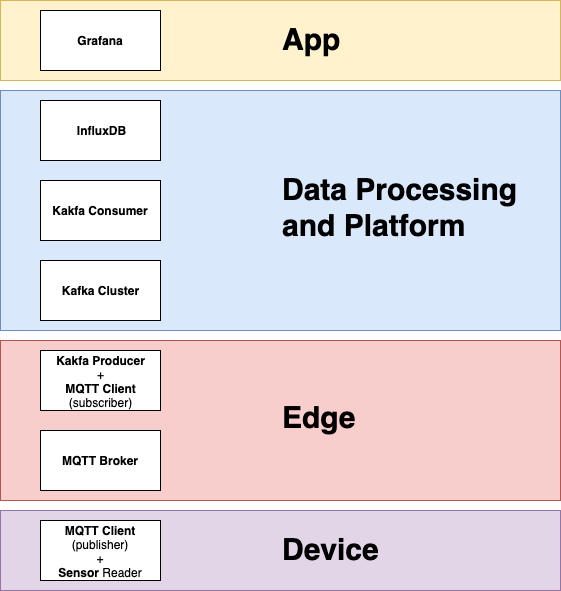

# Real Time Analytics for IoT Data

An example of a IoT data pipeline built in Master's in Big Data at University of Murcia.

- **Doc** dir includes a review of the techonologies used to create the *data pipeline*.
- In **code** dir, there is a set of resources developed to create a complete implementation.

