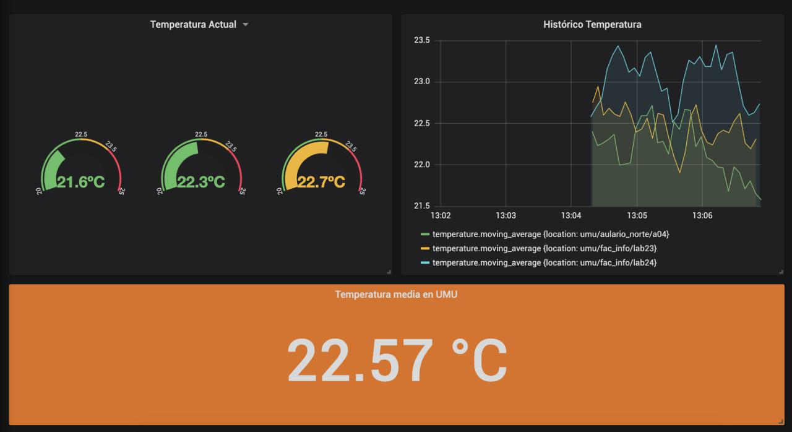

# Implementation

Code to run the *data pipeline* in a UMU simulated environment.

## Running

You can deploy an instance of all the services with:
```
docker-compose up -d
```

Everything is automated except Grafana configuration.

## Grafana

Set up using web app in [http://localhost:3000](http://localhost:3000). Default user: `admin` and pass: `admin`.

First, we should `add a data source` using `InfluxDB`. Default config is enough but we need to change **URL** field to `http://influxdb:8086` and **Database** field to `iotdata`. 

Now, we are ready to load the dashboard in `Create > Import > Upload .json file`. Select `umu-dashboard.json` and press `Import`.

A dashboard like this should appear:


## Stopping

We can stop running services with:
```
docker-compose down
```